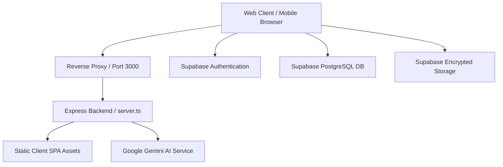

# JeevanCare

**AI-Powered Rural & Clinical Healthcare Management Platform**  
*Release Version: `v1.0.0`*

---

## Overview

JeevanCare is a comprehensive digital health management platform designed for universal clinical access, robust data privacy, and resilient operation across diverse connectivity environments. The application connects patients, doctors, and clinical administrators into a unified ecosystem featuring prescription OCR digitization, encrypted health record storage, intelligent AI clinical assistance, and rural-ready accessibility tools.

---

## Core Capabilities

- **Patient Dashboard**: High-level clinical status, active dose reminders, upcoming appointments, and instant vital tracking (BP, Blood Sugar, Adherence streaks).
- **Prescription Scanner & OCR**: Optical Character Recognition for handwritten and printed prescriptions, automated drug/dosage/duration extraction, confidence review, and direct manual overrides.
- **Medical Vault**: User-scoped document locker with categorization (Lab Reports, Prescriptions, Imaging, Discharge Summaries), PDF export, and signed-URL access.
- **Medication & Adherence Tracking**: Real-time course tracking with dose decrements, refill alerts, and daily schedule management.
- **Appointment Management**: Doctor discovery, consultation scheduling (In-person & Teleconsultation), and status lifecycle tracking.
- **AI Health Assistant**: Gemini-powered conversational assistant grounded in the patient's personal vault items, vitals logs, and prescriptions with built-in voice assistance.
- **Doctor Workspace**: Role-gated portal for physicians to manage appointments, review patient histories, author clinical notes, and manage prescriptions.
- **Admin Audit Panel**: Role-gated administrative suite for audit log inspection, system health metrics, and user management.
- **Nearby Healthcare Map**: Interactive medical facility and pharmacy locator with emergency contact integration.
- **Blood Donation Network**: Blood group compatibility registry and donor request coordination.
- **ABHA Card Integration**: Ayushman Bharat Health Account linking and profile integration.
- **Accessibility & Low-Literacy Support**: Multilingual voice assistance, high contrast themes, screen-reader semantics, and simplified UI modes.

---

## Technology Stack

- **Frontend**: React 19, TypeScript, Vite, Tailwind CSS v4, Lucide React Icons, Motion animations.
- **Visualization**: Recharts, D3.js.
- **Backend & Middleware**: Node.js, Express, TSX (Dev), ESBuild (Production CJS bundle).
- **Database & Auth**: Supabase (PostgreSQL, Supabase Auth, Supabase Storage).
- **AI & Computer Vision**: Google Gen AI SDK (`@google/genai` Gemini 2.5 / 1.5 Flash), MediaPipe Vision (`@mediapipe/tasks-vision`).
- **Mapping**: `@vis.gl/react-google-maps`.

---

## Architecture Overview



---

## Authentication & Data Isolation

- **Authentication**: Email & password authentication managed via Supabase Auth.
- **User-Scoped Caching**: Client-side storage and session caches are keyed by deterministic user hash (`getUserCacheKey(prefix, userId)`).
- **Session Transitions**: Logging out invalidates active React state and isolates storage partitions. User B never receives User A's data.
- **Role Guards**: Doctor and Admin portals are guarded at both the route level and the component render level.

---

## Local Development

```bash
# Install dependencies
npm install

# Start development server (Port 3000)
npm run dev

# Run TypeScript type check
npm run lint

# Clean build artifacts
npm run clean
```

---

## Production Build

```bash
# Compile client SPA and bundle backend server
npm run build

# Start production server
npm run start
```

---

## Environment Variables

See `.env.example` for all required environment keys:

```env
# Client Configuration (Exposed via Vite)
VITE_SUPABASE_URL=
VITE_SUPABASE_ANON_KEY=
VITE_GOOGLE_MAPS_API_KEY=

# Server-Side Secrets (Hidden from browser)
GEMINI_API_KEY=
```

---

## Known Verification Limitations

1. **Live Supabase RLS Policy Probing**: Database queries explicitly enforce client-bound user parameterization; external PostgreSQL RLS policy execution on live cloud instances requires external database administrative credentials to probe directly.
2. **PWA Service Worker in Preview**: Service worker registration is restricted in sandboxed iframe development environments.
3. **Automated Backups**: Backups are managed at the upstream cloud service tier (Supabase / GCP) and cannot be probed directly from the application runtime.

---

## Security & Clinical Notice

JeevanCare is a clinical workflow and supportive health assistant. The AI assistant and diagnostic scanner do **not** replace licensed physician judgment, certified laboratory analysis, or real-time emergency dispatch services. In life-threatening emergencies, patients must immediately contact official local emergency services.
