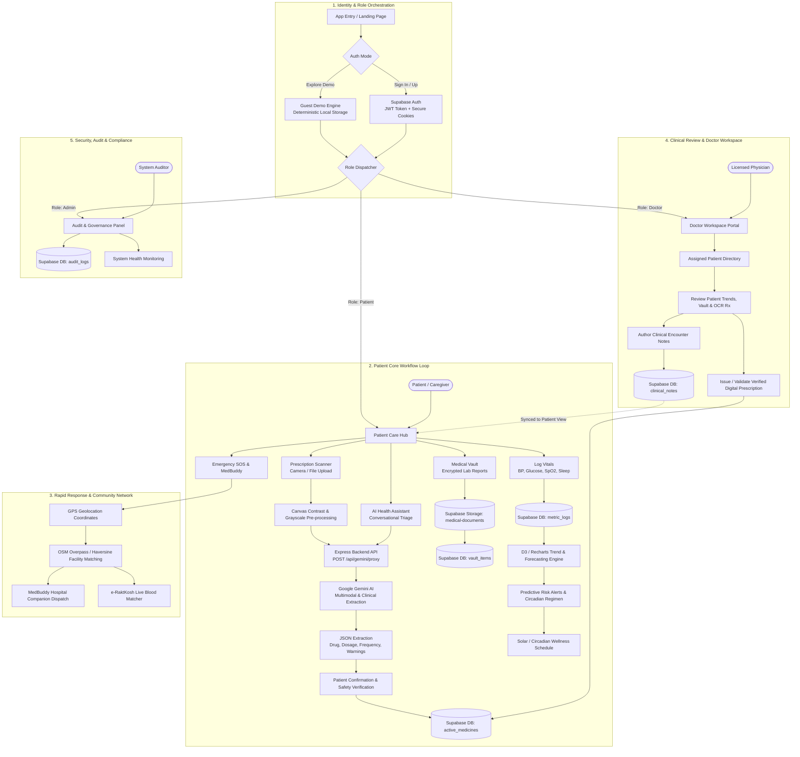
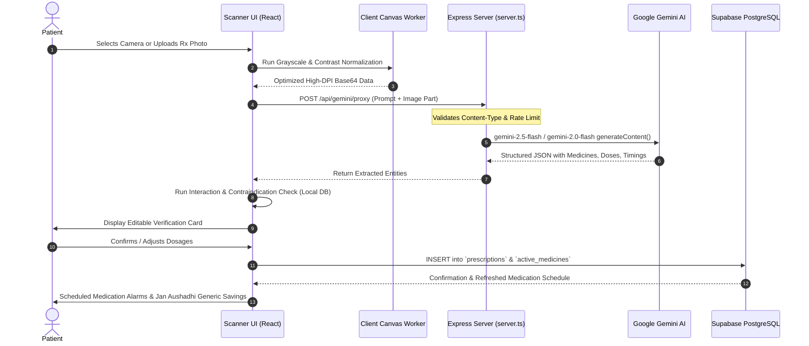
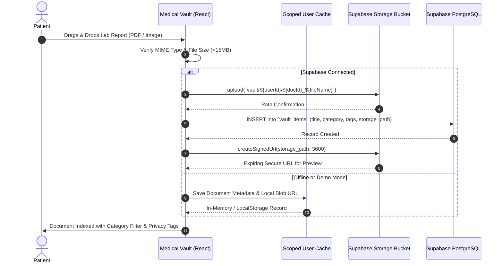
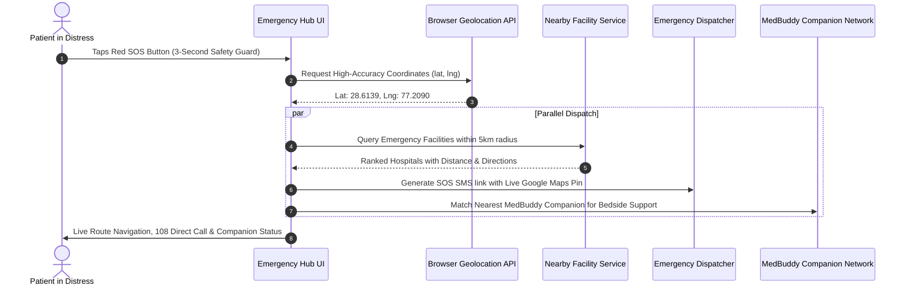
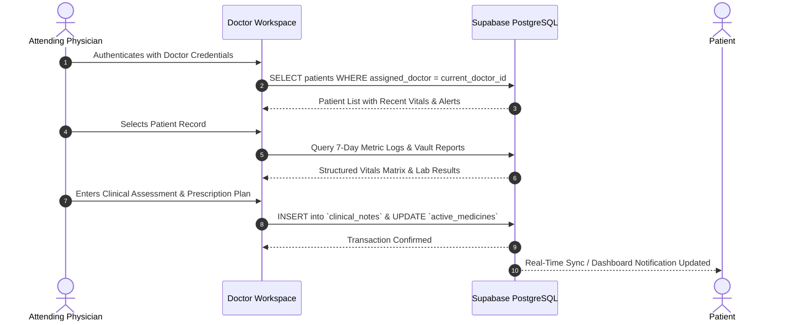

# Application Workflow Specification — JeevanCare

This document defines the comprehensive end-to-end application workflow, state transitions, subsystem interactions, and sequence diagrams for the JeevanCare platform.

---

## 1. Macro End-to-End Application Workflow

The following diagram illustrates how users, clinical professionals, edge sensors, server endpoints, and external services interact across the entire lifecycle of patient care:



---

## 2. Subsystem Workflow Diagrams

### 2.1 Prescription OCR & Medication Intelligence Pipeline



---

### 2.2 Medical Vault Encrypted Document Pipeline



---

### 2.3 Emergency SOS & MedBuddy Dispatch Workflow



---

### 2.4 Doctor Consultation & Clinical Note Workflow



---

## 3. Component Communication Matrix

| Source Component | Destination Component | Protocol / Channel | Payload / Schema | Security & Fallback |
| :--- | :--- | :--- | :--- | :--- |
| **React Client** | **Express Backend (`server.ts`)** | HTTP POST `/api/gemini/proxy` | Multimodal prompt, user clinical context, image data | API key secured on server; rate-limited; sanitized input |
| **React Client** | **Supabase Auth** | HTTPS REST / WebSocket | Email, password, session refresh token | JWT token stored securely; deterministic demo fallback |
| **React Client** | **Supabase Database** | PostgreSQL via `@supabase/supabase-js` | `metric_logs`, `active_medicines`, `vault_items`, `clinical_notes` | Row-Level Security (RLS) scoped to `auth.uid()` |
| **React Client** | **Supabase Storage** | HTTPS S3-compatible API | Encrypted PDFs, DICOM, Lab Images | Time-bound signed URLs (60-minute expiry) |
| **React Client** | **Browser Geolocation API** | W3C Geolocation API | `{ latitude, longitude, accuracy }` | User permission check; fallback to New Delhi center |
| **React Client** | **OpenStreetMap / Overpass** | HTTPS REST API | Bounding box coordinates | Client-side Haversine distance ranking |
| **React Client** | **Service Worker (`sw.js`)** | Cache API / Service Worker | Offline assets, shell HTML, icons | Offline fallback with background sync banner |

---

## 4. State Transition & Lifecycle States

```
[ App Init ] 
      │
      ├── (Check Local Storage / Supabase Session)
      │
      ├──► Mode: DEMO_GUEST ──► Seeded Deterministic Store ──► LocalStorage
      │
      └──► Mode: AUTHENTICATED ──► JWT Validated ──► Supabase PostgreSQL (RLS)
              │
              ├── Role: PATIENT ────► Vitals Tracker ──► OCR Scanner ──► Vault
              │
              ├── Role: DOCTOR ─────► Patient Directory ──► Consultation Notes
              │
              └── Role: ADMIN ──────► Audit Logs ──► System Performance
```

This workflow ensures complete transparency, compliance with privacy regulations, zero client-side credential leakage, and seamless continuity between offline and cloud-connected states.
