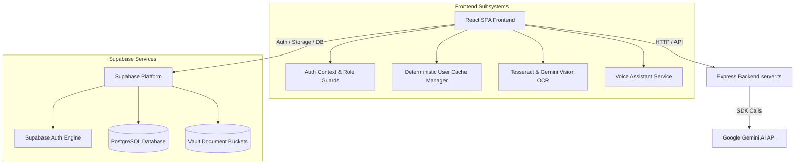

# System Architecture — JeevanCare v1.0.0

## 1. System Overview

JeevanCare is structured as a full-stack web application running Node.js and Express in the backend and React with TypeScript and Vite in the frontend. The application utilizes Supabase for authentication, relational data persistence, and encrypted document storage, and Google Gemini models for AI-driven clinical extraction and conversation.

---

## 2. Frontend Architecture

- **State Management**: React Context (`AuthContext`) coordinates session identity, active role switching, and global authentication state.
- **Route Architecture**: Dynamic view switching with guarded navigation states (`activeView`). Critical views are code-split using `React.lazy` and `Suspense`.
- **Styling & Theming**: Tailwind CSS v4 utilizing CSS custom variables and semantic neutral colors adhering to WCAG AA contrast standards. Supports seamless light and dark mode toggles.
- **Animation System**: `motion/react` provides physics-based transitions, drawer gestures, and accordion animations.

---

## 3. Backend Architecture

- **Server Entry (`server.ts`)**: Express server listening on `0.0.0.0:3000`.
- **Development vs. Production**:
  - *Dev*: Boots via `tsx` mounting Vite middleware in `middlewareMode`.
  - *Prod*: Bundles via `esbuild` to `dist/server.cjs` and serves precompiled static assets from `dist/` with a wildcard fallback for SPA routes.
- **API Endpoints**: Proxies Gemini generative AI queries and provides server-side health checks.

---

## 4. Authentication & Role-Based Access Control (RBAC)

- **Authentication Providers**: Supabase Auth (Email/Password).
- **Supported User Roles**:
  - `patient`: Access to personal dashboard, vault, prescriptions, appointments, AI assistant, and vitals.
  - `doctor`: Access to doctor workspace, assigned patient directory, clinical notes authoring, and prescription management.
  - `admin`: Access to system audit panel, platform logs, and user metadata management.
- **Role Enforcement**: Navigation links and route rendering are gated at the application root level.

---

## 5. Storage Architecture

- **Bucket Configuration**: Supabase Storage bucket `medical-documents`.
- **Pathing Convention**: `vault/${userId}/${documentId}_${fileName}`.
- **Access Model**: Signed URLs with time-bound expiration prevent permanent public URL exposure.

---

## 6. AI & OCR Architecture

- **AI Assistant**: Conversational assistant grounded with active user metrics and vault document excerpts via RAG prompt templates.
- **Prescription OCR Pipeline**:
  1. Image upload via drag-and-drop or device camera.
  2. Canvas pre-processing (grayscale, contrast normalization).
  3. Vision-based character extraction.
  4. Confidence analysis and structured JSON parsing (Drug, Dosage, Frequency, Duration).
  5. Human verification and editing before saving to database.

---

## 7. Performance & Caching

- **User-Scoped Caching**: LocalStorage keys are derived via `getUserCacheKey(prefix, userId)`. Demo sessions use `jeevancare_demo_*`; authenticated accounts use `jeevancare_<userId>_*`.
- **Vendor Chunking**: Bundles separated into isolated chunks (`vendor-charts`, `vendor-pdf`, `vendor-maps`, `vendor-supabase`, `vendor-genai`, `vendor-icons`, `vendor-motion`).
- **Resource Lifecycle**: MediaStreams and audio synthesizers are terminated upon component unmount.
